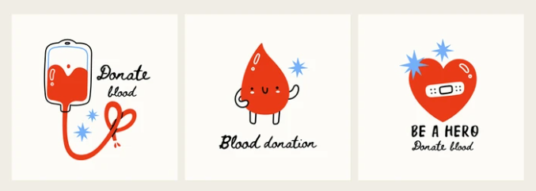

# Data Insights For Blood Donation MOH

Welcome to my Blood Donation Dashboard GitHub repository! This project aims to provide a modern and intuitive dashboard for monitoring and analyzing blood donation data. Whether you are a healthcare professional, researcher, or blood donation enthusiast, this dashboard is designed to offer valuable insights and latest data viz for daily trend blood donation.

I have provided graph chart and daily trend in this project that presents a comprehensive overview of key metrics related to blood donation activities. This includes data on donation frequency, blood types, and regional distribution. The goal is to provide users with a quick and insightful summary of the blood donation landscape.

Feel free to explore the dashboard, and don't hesitate to provide feedback or contribute to the project. Together, we can make a positive impact on the world of blood donation. Thank you for your interest and support!

